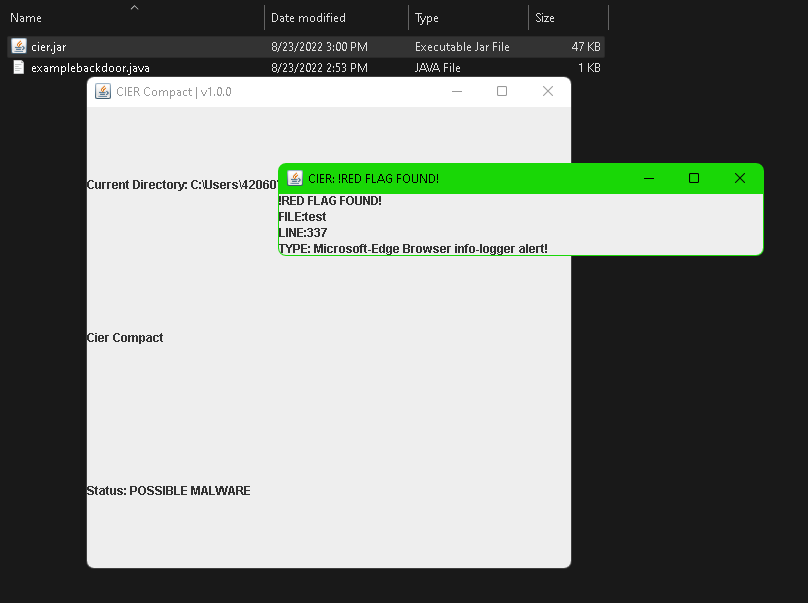

# cier
 
 |  |  | 
=====
> CIER is a Virus-Scanner, which works in a way, that it scans .java files/java projects for actual sequences, that are only used in backdoors

CIER compact showcase: 

### is it safe?
Yes, if you dont believe me, you can search the code yourself, or someone can search the code for you

### is it free?
Yes lol, why else would it be on github?

### how do i use it?

CIER-standard.jar:
> 1. Download the cier-standard the releases tab,

> 2. Decompile the software you want to scan, using some .jar decompiler

> 3. Run the cier file, and once you see "Enter folder to search", type the folder you want to search for any malware, or you can use the 

CIER-compact.jar:
> 1. Downloadt he file from the releases tab

> 2. decompile the file you want to scan

> 3. put the CIER file into the folder, where the decompiled .jar source code is(into the folder u decompiled the code to)

> 4. run the CIER file
